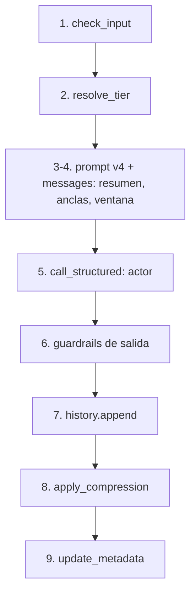
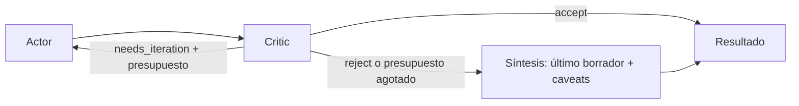

# Session 05 - Memory + Attachments

## Funcionalidad incremental

Se añade:
- Memoria conversacional en el servicio IA: sesiones en memoria del proceso (`app/sessions/`),
  con un historial de mensajes (ventana deslizante) y un `project_metadata` acumulado que no se pierde durante la conversación (siempre se mantiene). El objeto `project_metadata` contiene el nombre del proyecto, tecnologías, etc. y se va enriquecienco y completando con cada turno.
- Adjuntos (`.pdf`, `.docx`) extraídos localmente (Camino B) y enviados como texto dentro del prompt.
- Nuevo endpoint `POST /sessions/{session_id}/estimate` (multipart/form-data, bloqueante) que
  usa el historial + metadata de la sesión para mantener coherencia entre turnos.
- `GET /sessions/{session_id}` para inspeccionar el estado (nº de mensajes, metadata) y
  `POST /sessions` para crear una sesión nueva.
- Extracción de `project_metadata` mediante un LLM extractor: una segunda llamada barata con
  Instructor, después de cada turno, cuyo resultado se fusiona (`merge_with`) con lo ya sabido.
- Prompt `v3` (copia de `v2` + bloque `<project_metadata>` e instrucciones de conversación) y
  prompt `metadata_extraction/v1` para el extractor.
- Modo conversacional en Streamlit (`streamlit_app.py`), junto al formulario existente, con
  historial de chat, subida de adjuntos y panel lateral con la metadata y el tamaño del historial.

## Tecnologías

- pypdf: extrae el texto de un PDF página a página; si una página falla, se registra en el log y se ignora (no tira abajo el documento entero)
- python-docx: extrae los párrafos no vacíos de un `.docx`
- python-multipart: dependencia que FastAPI necesita internamente para poder parsear `Form`/`UploadFile` (`multipart/form-data`)
- fpdf2 (dev-dependency): genera PDFs mínimos válidos en los tests, sin necesitar un fichero de ejemplo en el repo
- Pydantic: modela `Message`, `ConversationHistory`, `ProjectMetadata` y `Session`, igual que ya modelaba `EstimationRequest`/`EstimationResult`
- Instructor: se reutiliza para la llamada de estimación (ahora con un array de `messages` arbitrario) y para la nueva llamada del extractor de metadata (`response_model=ProjectMetadata`)
- FastAPI `Depends` + `app.dependency_overrides`: `get_session_store()` es un singleton (como `get_openai_client()`), sustituible en los tests

## Decisiones de diseño

### Historial vs memoria

Se mantienen dos conceptos separados y complementarios:
- **Historial** (`ConversationHistory`): un array de mensajes `user`/`assistant`, con una ventana
  deslizante de `MAX_CONVERSATION_TURNS` pares. Es la memoria "a corto plazo", literal: lo que se
  dijo en los últimos turnos, en su forma original.
- **Memoria** (`ProjectMetadata`): hechos destilados (`project_name`, `assumed_team_size`,
  `mentioned_technologies`, `agreed_scope`), inyectados en el `system_prompt` de cada turno vía un
  bloque `<project_metadata>`. Es memoria "a largo plazo": sobrevive aunque el turno donde se dijo
  ese hecho ya haya salido de la ventana del historial.

El `system_prompt` nunca se guarda en el historial: se regenera en cada turno a partir del
metadata actual, así que siempre refleja el estado más reciente aunque la conversación sea larga.

### Por qué una ventana deslizante como estrategia por defecto

Es la opción más simple y barata: cada turno cuesta tokens proporcionales a
`1 (system) + 2 * MAX_CONVERSATION_TURNS (historial) + 1 (turno actual)`, con un tope fijo y
predecible. El riesgo es perder hechos antiguos que ya no están en la ventana — por eso existe el
`project_metadata` en paralelo: los hechos importantes se "rescatan" del historial antes de que se
recorten.

Qué empujaría a sustituirla por algo más sofisticado (p. ej. resumir los turnos descartados en vez
de tirarlos, o un historial por tópicos):
- El coste de tokens crece demasiado si `MAX_CONVERSATION_TURNS` necesita subir mucho para no
  perder contexto relevante.
- Se pierden matices que el extractor de metadata no captura (no todo es un hecho estructurado:
  una aclaración o una broma recurrente no caben en `ProjectMetadata`).

### Camino B para adjuntos (extracción local) y por qué

Se extrae el texto del PDF/Word localmente con `pypdf`/`python-docx` y se envía como texto plano
dentro del prompt, en vez de usar la Files API de un proveedor. Motivos:
- **Independiente del proveedor**: compatible con el fallback OpenAI↔Anthropic que ya tiene el
  proyecto. Con la Files API, el fichero solo existiría en el proveedor donde se subió; si el
  fallback cambia de proveedor a mitad de conversación, el fichero ya no sería accesible.
- **Más control**: se puede truncar (`MAX_ATTACHMENT_CHARS`), registrar en el log cuántos
  caracteres se extrajeron/truncaron, y tratar errores por página sin perder el documento entero.
- **Prepara el chunking de RAG** del módulo 3: ya tenemos una función que convierte un fichero en
  texto plano, el primer paso antes de trocearlo en chunks para un índice vectorial.

### Cómo se extrae el `project_metadata`: LLM extractor

Después de cada turno, una segunda llamada (barata, `METADATA_EXTRACTOR_MODEL`) con Instructor
recibe el metadata previo, el transcript enriquecido del turno y el resumen de la estimación, y
devuelve un `ProjectMetadata` con solo los hechos anclados en esos textos (null si no está claro).
El resultado se fusiona con `previous.merge_with(extracted)`: los escalares se sobrescriben solo si
el update trae un valor no nulo, y las tecnologías se unen sin duplicados (comparación
case-insensitive).

Trade-off frente a una heurística (regex/keywords):
- **Coste y latencia**: una llamada extra por turno, con su coste y tiempo, aunque usando un
  modelo barato y una respuesta corta.
- **Robustez**: un LLM entiende paráfrasis ("el equipo seremos cinco personas" → `assumed_team_size=5`)
  que una heurística basada en patrones fijos no captura.

Política de fallo: si la extracción falla por cualquier motivo (red, validación, proveedor caído),
se registra `metadata_extraction_failed` en el log y se devuelve el metadata anterior sin cambios.
La conversación nunca se cae por un fallo en esta llamada secundaria.

### Caches desactivadas en el camino conversacional

`estimate_conversational()` no usa ni la caché exact-match ni la semántica. La clave actual de
caché se construye a partir de `system_prompt` + `user_prompt`; en el camino conversacional, el
resultado también depende del historial y del `project_metadata` de la sesión, que esa clave no
tiene en cuenta. Dos sesiones distintas (o dos turnos de la misma sesión) podrían generar el mismo
`system_prompt` + `user_prompt` por una coincidencia textual, mientras el contexto real es distinto
→ el hit sería incorrecto. Queda documentado en el código y deliberadamente sin usar; una caché
correcta para este camino necesitaría una clave que incluya el estado de la sesión.

### Memoria volátil en proceso y sus límites

`SessionStore` es un `dict[str, Session]` en memoria del proceso, sin Redis ni base de datos. Se
acepta perder las sesiones al reiniciar el proceso (son conversaciones de una estimación, no datos
de negocio) a cambio de no añadir infraestructura todavía. Importante: **solo funciona con un único
worker de uvicorn**; con `--workers N>1` cada proceso tendría su propio diccionario, y una petición
podría caer en un worker que nunca vio esa sesión. La persistencia real (Redis/BBDD) se abordaría
más adelante si hiciera falta soportar varios workers o sobrevivir a un reinicio.

### Variables de entorno nuevas

| Variable | Default | Qué controla |
|---|---|---|
| `MAX_CONVERSATION_TURNS` | `6` | Pares user+assistant que conserva la ventana deslizante del historial |
| `MAX_ATTACHMENT_CHARS` | `60000` | Límite de caracteres por adjunto extraído (trunca, no rechaza) |
| `METADATA_EXTRACTOR_MODEL` | `gpt-4o-mini` | Modelo de la segunda llamada que extrae el `project_metadata` |
| `CONVERSATIONAL_PROMPT_VERSION` | `v3` | Versión del prompt usada por `estimate_conversational()` |

## Cómo invocar

### Lanzar tests unitarios
```
uv run pytest -v
```

### Levantar docker redis (necesita redis-stack, no redis:7-alpine, para el cache semántico/RediSearch)
```
docker compose up -d
```

### Levantar uvicorn (servidor web) para uso de FastAPI
```
uv run uvicorn app.main:app --reload
```

### Arrancar la aplicación streamlit (portal web con interfaz conversacional)
```
streamlit run streamlit_app.py
```

### Probar el flujo conversacional por línea de comandos (2 turnos + 1 adjunto)

Los ejemplos usan `curl.exe` (en PowerShell, `curl` es un alias de `Invoke-WebRequest`: hay que
llamar al binario real explícitamente) en una sola línea para que funcionen igual en PowerShell y
en una shell POSIX.

Crear una sesión:
```
curl.exe -X POST http://localhost:8000/sessions
```

Primer turno (sustituye `<session_id>` por el valor devuelto arriba):
```
curl.exe -X POST http://localhost:8000/sessions/<session_id>/estimate -F "transcript=We are building Acme Portal, a web SaaS for gym bookings." -F "project_type=web_saas" -F "detail_level=summary" -F "output_format=narrative"
```

Segundo turno, con un adjunto:
```
curl.exe -X POST http://localhost:8000/sessions/<session_id>/estimate -F "transcript=Here is the budget breakdown from the client, see the attached file." -F "project_type=web_saas" -F "detail_level=summary" -F "output_format=narrative" -F "attachments=@budget.pdf;type=application/pdf"
```

Inspeccionar el estado de la sesión (historial + metadata):
```
curl.exe http://localhost:8000/sessions/<session_id>
```


## Post-live: alinear solución con el profesor

Tras la clase en vivo se alineó el proyecto con la solución del profesor y con el punto de partida de la sesión 06. Se adaptó cada pieza a la arquitectura propia: funciones en `llm_service.py` con Instructor sobre LiteLLM, no `LLMWrapper` + `EstimationService`. `POST /api/v1/estimate` y `/estimate/stream` no
cambian (cachés y streaming incluidos).

### Qué se añadió

- **Wrapper observable** (`app/services/llm_wrapper.py`): `call_structured()` envuelve
  `create_with_completion` y devuelve `(resultado, LLMCallMeta)` con `latency_ms`, `tokens_in`,
  `tokens_out`, `cost_usd`, `model` y `provider`. Emite siempre `llm_call_completed` /
  `llm_call_failed` con esos seis campos más el contexto (`purpose`, `session_id`, `iteration`).
  La tabla `MODEL_COSTS` y `estimate_cost_usd()` salen de `app/config.py`. Todas las llamadas
  estructuradas no-streaming pasan por aquí: estimación, extractor de metadata, resumen, clasificador
  de anclas, actor ACB y critic. En streaming solo se unificaron los nombres de los campos del log final.
- **Compresión del historial** (`app/sessions/compression/`): anclas literales + resumen acumulativo
  + ventana reciente. `ConversationHistory.append()` ya no recorta; lo hace la política.
  Orden de los mensajes: `system`, resumen (mensaje `user` con prefijo fijo), anclas, ventana, turno actual.
- **Tier dinámico** (`app/sessions/tier_resolver.py`): `executive`, `pm`, `developer` o `default`,
  decidido por una cadena de reglas explicables (`nda_detected`, `regulatory_context`,
  `technical_audience`, `low_budget_pm`, `no_rule_matched`) o por un override `tier=` del cliente.
- **Prompt `v4`**: copia de `v3` + bloque `<audience>` por tier + `<critic_feedback>` opcional en el
  user prompt. `v1`-`v3` no se tocan.
- **Actor-Critic-Boss**: `POST /sessions/{id}/estimate-acb`, con `Critic` (`app/services/critic.py`),
  `Boss` (`app/services/boss.py`) y los schemas `CriticFeedback` / `BossTrace`.
- **Evals** (`evals/`): 16 casos dorados, tres métricas binarias y un runner CLI.
- **Endpoint de debug** `GET /sessions/{id}`: `message_count`, `max_turns`, `metadata`,
  `anchors_count`, `summary_chars`, `last_resolved_tier`, `last_tier_rule`.

Orden de un turno conversacional (el ACB comparte los pasos 1-4 y 7-9):



En el ACB el paso 5 pasa a ser un bucle (actor, critic, boss) y el guardrail de salida y el único
`append` se aplican solo al resultado final:



### Decisiones y trade-offs

**Ventana sola vs híbrida con anclas.** La ventana sola es predecible y barata, pero olvida sin
aviso: un NDA o un alcance congelado dicho en el turno 1 desaparece en el turno 7. La memoria
híbrida conserva literal lo que no se puede olvidar (anclas), resume el resto y mantiene la ventana
para el hilo vivo. A cambio el prompt ya no tiene un tope fijo: crece con las anclas
(`1 + resumen + anclas + 2*MAX_CONVERSATION_TURNS + 1`), y hoy no hay un máximo de anclas, así que una
conversación con muchos compromisos las acumula sin límite. Si el resumen falla se conserva el
anterior (`summary_failed`) y los turnos de esa pasada se pierden: la compresión es best-effort.

**Anclas heurísticas vs LLM.** La heurística (por defecto) son regex en inglés y español: gratis,
determinista y fácil de depurar, pero frágil ante paráfrasis ("ya tenemos todo firmado"). El modo
`llm` es un clasificador binario robusto a la paráfrasis, a cambio de una llamada por turno
expulsado. Si el clasificador falla, el turno se trata como no-ancla (`anchor_llm_failed`): peor caso, se
resume en vez de conservarse literal. Un falso positivo es más caro que un falso negativo, porque
las anclas no se expulsan nunca.

**Tier por reglas explicables y riesgo del override.** Una cadena ordenada de reglas puras permite
decir *por qué* se eligió un tier ("executive (nda_detected)") y probar cada regla por separado; un
clasificador LLM sería más flexible pero opaco y de pago. Las reglas son burdas a propósito (p. ej.,
"confidential" en un adjunto fuerza `executive`). El campo `tier` del formulario se acepta como
override para demos y evals, pero según los apuntes en producción el tier debería venir de un canal
autenticado: aceptarlo del cliente deja que cualquiera cambie el tono y el nivel de detalle de la respuesta.

**Critic estructurado y fail-open.** El critic devuelve un `CriticFeedback` validado (categorías y
severidades cerradas), no prosa: el Boss decide leyendo campos, y el feedback se puede inyectar tal cual en
el prompt del actor. Un validator impide `needs_iteration` sin issues `critical`/`major`, y el prompt
sesga hacia `accept` y `minor` en caso de duda, porque un falso positivo cuesta una vuelta extra
y degrada la respuesta. Si el critic falla, se registra `critic_failed_fallback_accept` y se acepta
el borrador: el ACB nunca empeora la disponibilidad respecto al actor solo. Lo contrario (un actor
que falla en un reintento) sí propaga el error y la petición acaba en 502, sin reutilizar el borrador anterior.
Aquí `math_error` es la primera línea de detección de descuadres: `totals_mismatch()` no es un
validator, solo produce un aviso, así que nada fuerza al actor a cuadrar los totales.

**Límite de iteraciones y síntesis.** `BOSS_MAX_ITERATIONS=3` son 1 borrador + 2 reintentos dirigidos;
con 2 el actor a menudo no puede resolver todos los issues. Si se agota el presupuesto o el critic
rechaza, el Boss no devuelve un resultado vacío: devuelve el último borrador con los issues abiertos
al inicio del `summary` (máx. 600 caracteres de avisos, respetando el `max_length`) y la confianza
a la mitad, con suelo en `LOW_CONFIDENCE_THRESHOLD` para no activar el validator de "Out of scope".
Ocultar el mejor borrador disponible detrás de un placeholder serviría peor al usuario; que el bucle no
convergió queda en `BossTrace.final_decision == "synthesize"`.

**Coste y latencia del ACB.** Cada turno cuesta hasta `2 × BOSS_MAX_ITERATIONS` llamadas (actor +
critic por vuelta) y es secuencial, así que la latencia se multiplica. Por eso es opcional y por
endpoint (`/estimate-acb`), no un modo global: el usuario o el cliente decide cuándo compensa. La
response agrega el coste y la latencia de todas las llamadas (`BossTrace.llm_usage`).

**Métricas binarias deterministas vs LLM-as-judge.** Las tres métricas de `evals/` (esquema, rangos de
coste y duración, recall de contenido) no cuestan, no varían entre ejecuciones y dicen exactamente por qué
falla un caso. Un LLM-as-judge mide calidad cualitativa (¿está bien justificada esta fase?), pero es de
pago, no determinista y hereda los sesgos del juez. Aquí se empieza por lo barato y se deja el juez para
cuando las métricas binarias ya no discriminen.

### Variables de entorno nuevas

| Variable | Default | Qué controla |
|---|---|---|
| `CONVERSATIONAL_PROMPT_VERSION` | `v4` | Pasa de `v3` a `v4` (con `<audience>` y `<critic_feedback>`) |
| `ANCHOR_DETECTION_MODE` | `heuristic` | `heuristic` (regex) o `llm` (clasificador por turno expulsado) |
| `COMPRESSION_MODEL` | `gpt-4o-mini` | Modelo del resumen acumulativo y del clasificador de anclas |
| `CRITIC_MODEL` | `gpt-4o-mini` | Modelo del critic del ACB |
| `BOSS_MAX_ITERATIONS` | `3` | Vueltas actor+critic del ACB (1 borrador + 2 reintentos) |

El `.env` local no se actualiza solo: cambia `CONVERSATIONAL_PROMPT_VERSION` a `v4` y reinicia uvicorn
(`--reload` no vigila `.env`).

### Cómo ejecutar los evals

> **Aviso de coste:** `evals.run` hace llamadas REALES al LLM (y a la Moderation API). Cada caso del modo
> `acb` puede costar hasta `2 × BOSS_MAX_ITERATIONS` llamadas. No forma parte de `pytest`. Empieza con `--limit` bajo.

```
uv run python -m evals.run --mode actor --limit 3
uv run python -m evals.run --mode acb --limit 3
uv run python -m evals.run --mode actor --http http://localhost:8000 --output report.json
```

Por defecto corre en proceso (`TestClient`, un `SessionStore` nuevo por caso); con `--http` ataca un
servidor ya levantado. Para cada caso crea una sesión, llama a `/estimate` (modo `actor`) o a
`/estimate-acb` (modo `acb`) y consulta `GET /sessions/{id}` para comparar `last_resolved_tier` con
`expected_tier`. Un 400 de guardrail en un caso `expected_out_of_scope` cuenta como acierto. La salida
es una fila por caso (latencia, coste, iteraciones ACB y PASS/FAIL por métrica) y un recuento final;
`--output` guarda el informe completo en JSON.
